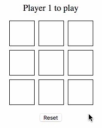

Mandatory exercise 2
==================

**The deadline for this exercise is Monday April XX, 23.59.**

For this **mandatory exercise 2** your should work on **master branch only**.

### Preparation

1. Create a new repository on [Github](github.com) called **mandatory-react**

2. Follow the instructions that Github gives you; create a local repository and add a remote or clone
the recently created repository.

### Submission

When you do the submission of your exercise in Ping Pong, **before the deadline**,
you will enter the link to your repository, such as:

```
https://github.com/mygithubusername/mandatory-react
```

The teacher will look in the **master branch**. If any commits are done to the master branch after the deadline, the grade IG will follow.

You will either get **G** or **IG** on the mandatory exercises.

### Instructions

Your job is to finish implementing a Tic Tac Toe app! The codebase is split into two parts;

1. **`src/logic`: The pure TicTacToe game logic
2. **`src/app`: A React app acting as a UI layer for that logic

### The logic parts

Check the `src/logic/index.js` file - there you'll find the `makeMove` function that you need to finish! You'll be applying a BDD-based workflow, using unit tests with Jest in the `test/logic.spec.js` file.

Here's the suggested workflow:

1. Read through the comments in the `src/logic/index.js` file so you understand how the game is supposed to work
1. Read the existing test in the `test/logic.spec.js` file.
1. Execute the tests by running `npm run test` in the console, watch it fail.
1. Edit `src/logic/index.js` until you can make the test pass.
1. Add a new unit test for more functionality (perhaps the second move?) in the test file.
1. Edit the logic file until the test passes.
1. Repeat until you have a fully functioning game!

Your unit tests don't need to cover every single scenario (for example, you don't have to check every possible win line), but they should still leave you reasonably sure the logic works.

A potentially helpful tip: the possible winning positions in the board are:

```javascript
const winPatterns = [[0,1,2], [3,4,5], [6,7,8], [0,3,6], [1,4,7], [2,5,8], [0,4,8], [2,4,6]];
```

### The React parts

Now for the React app! There are some stub components in place, enough to see something actually appear on screen.

There are three components in total:

* `App` which deals with the main game logic
* `Tile` which renders a single tile on the board
* `Message` which displays a status message

Here's the suggested workflow:

1. Start the webpack dev server by doing `npm run start:dev` in the terminal
1. Open a browser tab at `http://localhost:3000`
1. Hack away at the code, and webpack will recompile and reload the tab on every change
1. If you ever change the static files (in the `public` folder) you must run `npm run copypublic`

### Demo

The finished app should look and behave something like this:


